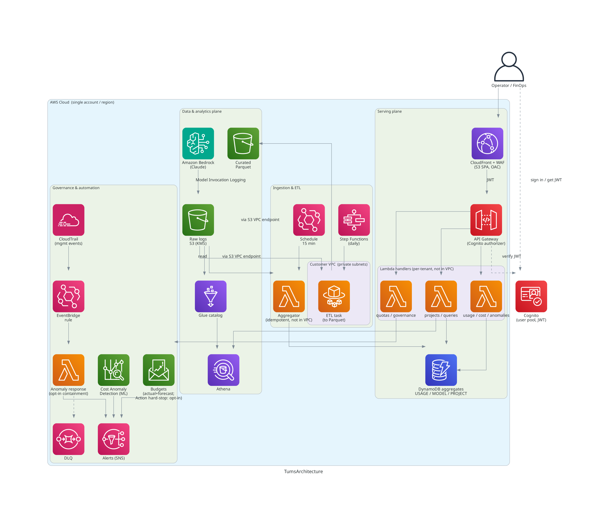

# Token Usage Monitoring System

A **cross-industry, multi-tenant** platform for monitoring **Amazon Bedrock** token usage,
detecting cost anomalies, automating incident response, and running forensic analytics —
deployable into **any AWS account**. Built AWS-native with the
[AWS Well-Architected Framework](https://docs.aws.amazon.com/wellarchitected/latest/framework/welcome.html).

> Vendor-neutral and customer-agnostic. No customer-specific names, accounts, or data are
> baked into the code — everything customer-specific is configuration.

---

## Executive summary

Organizations running Bedrock-based workloads (coding assistants, RAG, agents) need to account
for token consumption with the same rigor as any other cloud cost. That is harder than it looks,
for reasons specific to how Bedrock works:

- Native CloudWatch alarms rely on **static thresholds** that must be set manually and re-tuned
  as usage grows.
- Bedrock is a **usage-billed API**. Unlike consumer Claude subscription plans (which ration
  usage on a rolling window), it provides no quota that auto-resets to cap spend — its token
  quotas are rate limits, not cost caps.
- Bedrock invocation logs record the **IAM caller, but not an application-level user or project**,
  so attributing cost to a team requires additional tagging.
- Workloads that reuse context generate large volumes of **prompt-cache reads**, billed at a
  fraction of the standard input rate — so raw token totals overstate the real bill.

This platform addresses three recurring questions when operationalizing Bedrock cost:

| Concern | What it provides |
|---|---|
| **Observability** — proactively track & alert on token cost | Layered: CloudWatch metrics, AWS Cost Anomaly Detection (ML, learns a baseline instead of fixed thresholds), forecasted AWS Budgets, and forensic Athena analytics — in one dashboard. |
| **Controls** — prevent cost spikes | AWS Budgets Action can apply a restrictive IAM policy at a spend threshold (a hard cost cap); Service Quotas bound per-model throughput; an opt-in, off-by-default automated-response path can contain an offending principal. |
| **Operating practices** — keep cost predictable | Enable invocation logging on day one; tag requests for project/user attribution; tier models by task; and report prompt-cache reads separately so reported cost reflects the actual bill. |

**Scope of what the platform adds.** It does not change Bedrock's pricing or behavior. Its
contribution is to **measure, attribute, and present** usage and cost accurately, and to wire
native AWS governance (anomaly detection, budgets, quotas) into a single, deployable, multi-tenant
system. Separating prompt-cache reads (priced at the documented 0.1x input rate) from standard
input tokens yields a materially lower — and more accurate — cost figure than a raw token count
implies; the magnitude depends on a given workload's cache-hit ratio.

---

## Features

### In the dashboard (operator-facing)

- **Usage** — hourly token time series + a Bedrock token-quota / throttle headroom panel
- **Cost** — estimated spend per model + a prompt-cache savings KPI
- **By Project** — per-project/user attribution; fast (DynamoDB) / full (Athena + names) toggle
- **Governance** — budget status (limit / actual / forecast) + enforcement posture
- **Anomalies** — anomaly & alert feed with severity
- Cognito sign-in; per-tenant isolation on every request

### Behind the scenes

- **Data plane** — Bedrock Model Invocation Logging -> S3 (KMS) -> Glue + Athena workgroup
- **Aggregation** — EventBridge-scheduled Lambda (every 15 min) folds logs into DynamoDB
  (idempotent, watermarked), including per-project rollups for fast reads
- **Anomaly detection** — AWS Cost Anomaly Detection (ML) -> SNS
- **Automated response** — CloudTrail -> EventBridge -> Lambda -> SNS, with a dead-letter queue;
  opt-in per-principal containment (self-lockout guarded)
- **Cost controls** — AWS Budgets (actual + forecasted) + opt-in Budget Action hard-stop;
  Service Quotas headroom surfaced
- **Heavy ETL** — Step Functions -> ECS Fargate (daily) compacts raw logs to partitioned Parquet
- **API** — 7 REST endpoints behind a Cognito authorizer, least-privilege IAM per function
- **Forensics** — parameterized, tenant-scoped Athena query templates
- **Integration** — a request-metadata tagging helper for project/user attribution
- **Audit** — CloudTrail trail; CloudWatch metrics & alarms

### Platform

- AWS CDK (TypeScript), 8 independently deployable stacks, config-driven, any AWS account
- Multi-tenant (JWT tenant claim); CI/CD (GitHub Actions + GitLab CI)
- KMS encryption at rest, TLS in transit, no public buckets, WAF, scoped IAM

---

## Architecture at a glance



The diagram reflects the deployed stacks. Everything runs inside a single AWS account/region;
only the **Fargate ETL task runs inside a VPC** (private subnets), reaching S3 via a VPC gateway
endpoint — the serverless API and ingestion paths intentionally stay outside the VPC. The dashed
edges are authentication / asynchronous paths (Cognito sign-in and JWT verification, the
dead-letter queue). The AWS Budgets **Action hard-stop** and per-principal containment are
opt-in and off by default.

- **Full design:** [`docs/ARCHITECTURE.md`](./docs/ARCHITECTURE.md)
- **Well-Architected review (6 pillars):** [`docs/WELL_ARCHITECTED.md`](./docs/WELL_ARCHITECTED.md)

### Documentation

| Doc | What |
|---|---|
| [`docs/ARCHITECTURE.md`](./docs/ARCHITECTURE.md) | System design, components, CDK stack decomposition |
| [`docs/WELL_ARCHITECTED.md`](./docs/WELL_ARCHITECTED.md) | Mapping to the six AWS Well-Architected pillars |
| [`docs/MONITORING_APPROACH.md`](./docs/MONITORING_APPROACH.md) | Source-verified monitoring mechanisms (metrics, logging, anomaly detection) |
| [`docs/GOVERNANCE_FAQ.md`](./docs/GOVERNANCE_FAQ.md) | Cost governance FAQ — observability, controls, operating practices |
| [`docs/ATTRIBUTION.md`](./docs/ATTRIBUTION.md) | Per-user / per-project usage attribution model |
| [`docs/INTEGRATION.md`](./docs/INTEGRATION.md) | Customer integration: request-metadata tagging helper |
| [`docs/MULTI_TENANCY.md`](./docs/MULTI_TENANCY.md) | Tenant isolation model |
| [`docs/VERIFICATION.md`](./docs/VERIFICATION.md) | Architecture validation + real-data schema findings |
| [`docs/ROADMAP.md`](./docs/ROADMAP.md) | Honest gap analysis — what's validated vs planned |
| [`docs/test-reports/`](./docs/test-reports/) | Per-feature test reports (unit + real-AWS validation) |
| [`CHANGELOG.md`](./CHANGELOG.md) | Notable changes by milestone |
| [`docs/DEPLOYMENT.md`](./docs/DEPLOYMENT.md) | Step-by-step deploy guide |
| [`AGENTS.md`](./AGENTS.md) | Guidance for AI coding agents working in this repo |

---

## Tech stack

| Layer | Technology |
|---|---|
| IaC | AWS CDK (TypeScript) |
| Compute | Hybrid — Lambda (API/events) + ECS Fargate (heavy ETL) |
| API | API Gateway (REST) + Cognito authorizer |
| Front-end | React + Vite + TypeScript |
| Hosting | S3 + CloudFront (Origin Access Control) |
| Data | S3 + Glue + Athena (+ Parquet), DynamoDB |
| Automation | EventBridge, Step Functions, SNS |
| Governance | Cost Anomaly Detection, AWS Budgets |

---

## Repository layout

```
.
├── docs/        Architecture, Well-Architected review, monitoring approach, ADRs, runbooks
├── infra/       AWS CDK app — Network/Data/Logging/Auth/Api/Automation/Etl/Frontend stacks
├── backend/     Lambda handlers + shared libs + Fargate ETL job
├── frontend/    React + Vite dashboard SPA
├── .github/     CI/CD workflows
└── scripts/     bootstrap / deploy / teardown helpers
```

---

## Prerequisites

- An AWS account + credentials (`aws configure`) with permission to deploy the stacks.
- Node.js 20+, npm, AWS CDK v2 (`npm i -g aws-cdk`), Docker (for Fargate image + Lambda bundling).
- Amazon Bedrock model access enabled in your target Region.

---

## Quick start

```bash
# 1. Install everything (infra + backend + frontend)
make install

# 2. Run the test + build + synth gates (no AWS account needed)
make test          # backend unit tests
make build         # backend type-check + frontend build
make synth ENV=ci  # cdk synth using the tracked placeholder config

# 3. Configure your own environment to deploy
cp infra/lib/config/example.env.json infra/lib/config/dev.json
$EDITOR infra/lib/config/dev.json     # set "account" and "region"

# 4. Bootstrap CDK once per account/region, then deploy
cd infra && npx cdk bootstrap && cd ..
make deploy ENV=dev

# 5. Build & publish the dashboard (prints the CloudFront URL)
make deploy-frontend ENV=dev
```

`make help` lists all targets. Full step-by-step (including teardown) is in
[`docs/DEPLOYMENT.md`](./docs/DEPLOYMENT.md). AI coding agents: see [`AGENTS.md`](./AGENTS.md).

---

## Status

Functionally complete and validated end-to-end against a real AWS account: data pipeline
(Bedrock logging → S3 → Athena), ingestion aggregator, REST API (usage / cost / anomalies /
projects / quotas / governance / forensic queries), Cognito auth, and a React dashboard with
**Usage, Cost, By-Project, Governance, and Anomalies** pages, plus event-driven anomaly response.

The full cost-governance feature set (issues #1–#9) is implemented and validated — ML cost
anomaly detection, token-quota/throttle monitoring, prompt-cache savings, opt-in Budget Action
hard-stop + per-principal enforcement, request-metadata tagging helper, per-project
pre-aggregation, Fargate ETL, and CORS/custom-domain hardening. See [`CHANGELOG.md`](./CHANGELOG.md),
[`docs/ROADMAP.md`](./docs/ROADMAP.md), and [`docs/VERIFICATION.md`](./docs/VERIFICATION.md).

Two items remain intentionally pending real-AWS exercise (off-by-default, risk-managed): the live
Budget Action **freeze** (needs a throwaway test IAM role) and the Fargate ETL **Parquet run**
(needs the Etl stack deployed). Both are marked 🟡 in the roadmap.

## Validation gates

CI (GitHub Actions and GitLab CI) runs, and any change must pass:

1. `cd backend && npm test` — Jest unit tests
2. `cd backend && npx tsc --noEmit` — type-check
3. `cd frontend && npm run build` — frontend build
4. `cd infra && npx cdk synth --context env=ci` — infrastructure synthesis

## License

MIT — see [`LICENSE`](./LICENSE). Suitable for public release.
